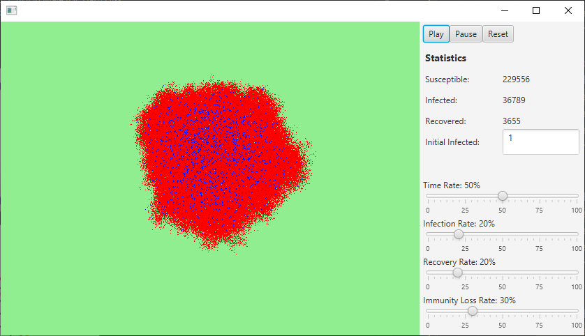

# SIRS_Model
<h4>Simulation of SIRS for epidemics</h4>

Real time interactive functionality for simulating a person's state during infection. Multithreading, 2 bufferes used to improve update efficiency, and calculated it to be 60fps so it's not heavy on cpu resources.

<h5>Susceptible -> Infectious -> Recovering -> Susceptible</h5>
